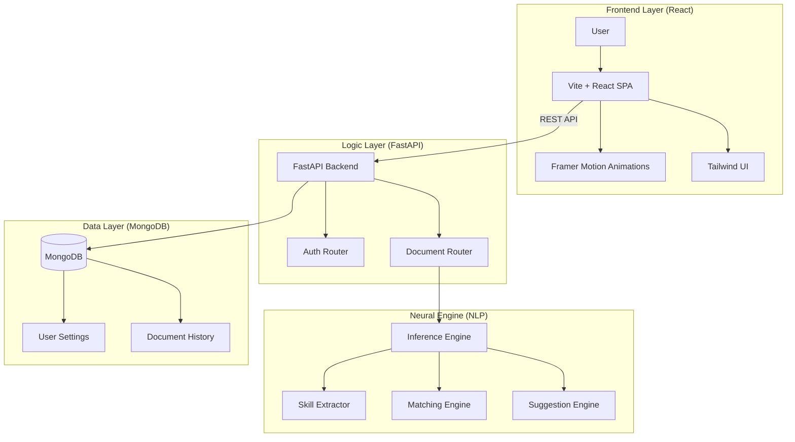

# 🧩 SkillMatch - AI-Powered Resume Matcher

SkillMatch is a premium, intelligent internal tool designed to revolutionize the recruitment process. By leveraging advanced Natural Language Processing (NLP) and a modern high-performance micro-stack, SkillMatch accurately aligns candidate resumes with job descriptions, revealing hidden gems and surface-level misalignments with surgical precision.

---

## 🏗️ System Architecture

SkillMatch follows a decoupled, modern architecture designed for speed and scalability.



---

## 🌊 Core Flow & NLP Pipeline

The "Neural Pulse" of SkillMatch lies in its multi-stage NLP pipeline:

1.  **Ingestion & Preprocessing**: Raw text is extracted from PDFs/DOCX and normalized (case folding, stop-word removal, lemmatization).
2.  **Entity Recognition**: The `Skill Extractor` uses high-precision Regex patterns with word-boundary awareness to identify technical and soft skills.
3.  **Vectorization**: Documents are transformed into Sparse Vectors (TF-IDF) to capture the relative importance of terms.
4.  **Similarity Scoring**: `Cosine Similarity` is calculated between the Resume and JD vectors to produce a match percentage.
5.  **Gap Analysis**: Missing skills are identified by comparing extracted sets and categorized via a curated **Skill Taxonomy**.
6.  **Intelligent Suggestions**:
    *   **Co-occurrence**: Suggests tools often used together (e.g., Python → Pandas).
    *   **Semantic Proximity**: Uses `Sentence-Transformers` (MiniLM) to find related skills in high-dimensional vector space.

---

## 🚀 Key Features

*   **Neural Analysis**: High-precision matching using TF-IDF and Cosine Similarity.
*   **Skill Gap Intelligence**: Visualize exactly what's missing between a candidate's profile and the job requirements.
*   **Smart Suggestions**: AI-driven recommendations for upskilling or related technologies.
*   **Journey History**: Full persistence of previous analyses for recruiters to track candidate evolution.
*   **Admin Console**: Real-time usage statistics and dynamic skill taxonomy management.
*   **Zen UX**: A premium, responsive interface featuring glassmorphism and smooth micro-animations.

---

## 🛠️ Tech Stack

*   **Frontend**: React 19, Vite, Tailwind CSS 4, Framer Motion, Lucide Icons.
*   **Backend**: FastAPI, Uvicorn, Jose (JWT).
*   **Database**: MongoDB.
*   **NLP Engine**: Scikit-Learn (TF-IDF), SpaCy (Entities), Sentence-Transformers (Embeddings), NLTK.

---

## 📂 Project Structure

```bash
SkillMatch/
├── backend/            # FastAPI Application
│   ├── routers/        # API Endpoints (Auth, Documents)
│   ├── main.py         # Backend Entry Point
│   ├── models.py       # Pydantic Schemas
│   └── database.py     # MongoDB Connection & Config
├── frontend-react/     # Vite + React Application
│   ├── src/
│   │   ├── components/ # Atomic UI Elements
│   │   ├── pages/      # Dashboard, History, Admin, Landing
│   │   └── context/    # Global State Management
├── nlp/                # Core AI Inference Engine
│   ├── matcher.py      # Similarity & Gap Analysis
│   ├── skill_extractor.py # Regex Entity Recognition
│   └── suggestion_engine.py # Co-occurrence & Embedding Logic
├── app_data/           # Knowledge Base
│   ├── skills_list.txt # Base Extraction Dictionary
│   └── skill_taxonomy.py # Categorization Logic
├── requirements.txt    # Python Dependencies
└── .env                # Environment Configuration
```

---

## ⚙️ Getting Started

### 1. Prerequisite Setup
*   Clone the repository.
*   Ensure **MongoDB** is running (local or Atlas).
*   Configure the `.env` file:
    ```env
    MONGO_URI=mongodb://localhost:27017/
    SECRET_KEY=yoursecretkey
    ALGORITHM=HS256
    ```

### 2. Backend Execution
```bash
# Activate virtual environment
python -m venv venv
.\venv\Scripts\activate

# Install dependencies
pip install -r requirements.txt

# Start Server
uvicorn backend.main:app --reload
```
*API Docs available at: `http://localhost:8000/docs`*

### 3. Frontend Execution
```bash
cd frontend-react
npm install
npm run dev
```
*App available at: `http://localhost:5173`*

---

## 🛠️ Troubleshooting

### MongoDB Connection Issues (SSL/Whitelist)
If you encounter `SSL handshake failed` or `Timeout` errors:
1.  **IP Whitelisting**: Go to [MongoDB Atlas](https://cloud.mongodb.com/) -> **Network Access** -> **Add IP Address** -> **Add Current IP Address**.
2.  **Dependencies**: Run `pip install -r requirements.txt` to ensure `certifi` is installed.
3.  **Connection String**: Verify your `MONGO_URI` in the `.env` file is correct and includes the password.

---

## 📈 Future Roadmap
- [ ] **LLM Integration**: Deep qualitative analysis using OpenAI/Anthropic.
- [ ] **Automated PDF Reports**: Export branded match reports for candidates.
- [ ] **Team Collaboration**: Shared folders for recruitment teams.


---
© 2026 SkillMatch Team. Licensed under MIT.
