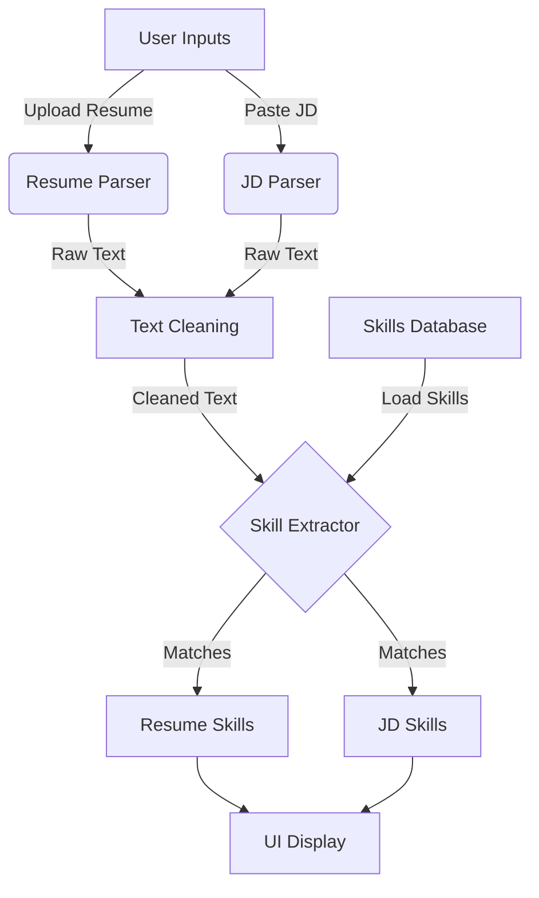

# ⚙️ Project Workflow: SkillMatch

This document outlines the internal data flow and processing pipeline of the SkillMatch application.

---

## 1. Input Stage
The workflow begins with user inputs via the Streamlit interface (`app.py`).

*   **Resume Input**: User uploads a file.
    *   *Supported Formats*: `.pdf`, `.docx`
    *   *Module*: `modules.resume_parser`
*   **Job Description Input**: User pastes text into a text area.
    *   *Module*: `modules.jd_parser`

## 2. Text Extraction Layer
Raw content is converted into a standard string format.

*   **Resume Parsing**:
    *   If PDF: `pdfplumber` iterates through pages to extract text.
    *   If DOCX: `python-docx` reads paragraphs.
    *   *Output*: Raw string of resume content.
*   **JD Processing**:
    *   Raw text is trimmed and validated (non-empty).
    *   *Output*: Raw string of job description.

## 3. Preprocessing & Cleaning Layer
Raw text is noisy (contains punctuation, casing issues, common words). We clean it to ensure accurate matching.

*   **Module**: `modules.text_cleaner`
*   **Steps**:
    1.  **Lowercasing**: `Python` becomes `python`.
    2.  **Noise Removal**: Regex removes special characters and numbers (e.g., `C++` handled carefully or stripped depending on regex, usually specialized). *Current regex allows letters matches.*
    3.  **Tokenization**: Splitting text into individual words.
    4.  **Stopword Removal**: Removing words like "and", "the", "with" using `nltk` corpus.
*   **Output**: Cleaned, normalized string ready for analysis.

## 4. Knowledge Base Loading
The system needs a reference for what constitutes a "skill".

*   **Source**: `data/skills_db.csv`
*   **Loader**: `modules.skill_extractor.load_skills()`
*   **Process**: Reads CSV, converts all skills to lowercase, returns list.

## 5. Skill Extraction Engine
The core logic matches the knowledge base against the cleaned text.

*   **Module**: `modules.skill_extractor`
*   **Function**: `extract_skills(text, skills_list)`
*   **Logic**:
    1.  Iterate through every skill in the loaded `skills_list`.
    2.  Check if the skill string exists in the cleaned text.
    3.  Collect matches.
    4.  Remove duplicates (convert to Set).
*   **Output**: Two lists of unique skills:
    *   `resume_skills`: Skills found in the user's resume.
    *   `jd_skills`: Skills found in the job description.

## 6. Visualization & Output
The results are presented back to the user in `app.py`.

*   **Display**:
    *   Extracted & Cleaned text previews (for verification).
    *   List of Skills in Resume.
    *   List of Skills in Job Description.
    *   (Future) Overlap visualization and missing skills.

---

## Summary Diagram

